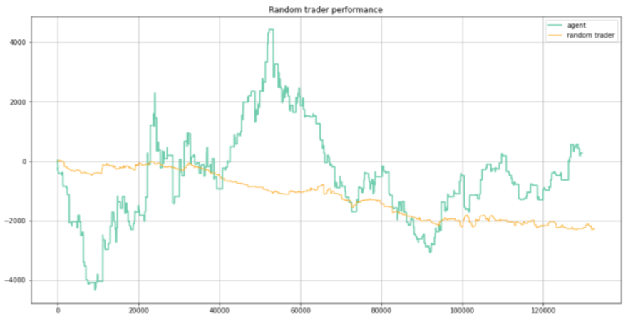

# Algorithmic trading using Deep-Q Reinforcement Learning methods
Applying the **Deep Q Learning** algorithm originally developed by Google Deepmind and adapted to play the financial trading game. The agent developed was trained to learn trading Bitcoin in our simulated BitMEX exchange.

Reinforcement learning is an important type of Machine Learning technique where an agent learn how to behave in a environment by performing actions and seeing the results. It will learn from the environment interacting with it and receiving rewards for performing actions.


## Asset
We designed our study to be asset agnostic as it can be used with any market or commodity like FX, stocks, indexed futures, . . . We have used, just for convenience, the **Bitcoin/US dollar Perpetual Inverse Swap Contract (XBTUSD)** traded in the BitMEX market.

## Datasets
**OHLCV dataset** contains classical Open, High, Low, Close, and Volume data.  
This dataset is available from [BitMEX](https://bitmex.com) exchange itself.

**Order Book** dataset contains features like depth, volume, weighted spread, and slope. The 'slope' feature is calculated according to [Naes and Skjeltorp 2004].  
XBTUSD **order book historical** dataset can be ordered from [algorithmic.ch](https://algorithmic.ch/).

## Test strategies
We created two strategies to test the reinforcement learning trading algorithm developed, the **look-forward** one, that slices the data in consecutive train and test sets and the **online** one, resembling real-time trading, were the training takes place at the same time as the acting.

## Results
Maybe the biggest problem to determine the performance of our agent is that, due to the nature of the Deep Reinforcement Learning algorithm, it is very sample inefficient and is extremely slow to run.

We found that the look-forward strategy performed better that the online strategy one. The look-forward strategy sees more than 3 million samples and the online strategy only 130.000 for the same 3 month of testing period, so it seems like a confirmation about the sample hungriness of the reinforcement learning models [Irpan 2018].

Anyway we found promising results:

## Usage
```shell
$ ./trader.py -h
```

## References
Irpan, A. 2018. Deep Reinforcement Learning Doesn’t Work Yet. https://www.alexirpan.com/2018/02/14/rl-hard.html.

Naes, R., & Skjeltorp, J. A. (2004). Order Book Characteristics and the Volume-Volatility Relation: Empirical Evidence from a Limit Order Market. SSRN Electronic Journal, 1–33. http://doi.org/10.2139/ssrn.565323